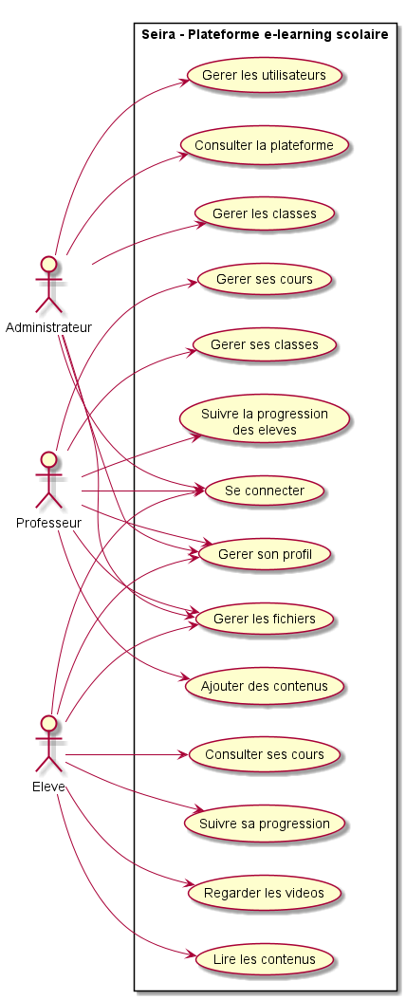
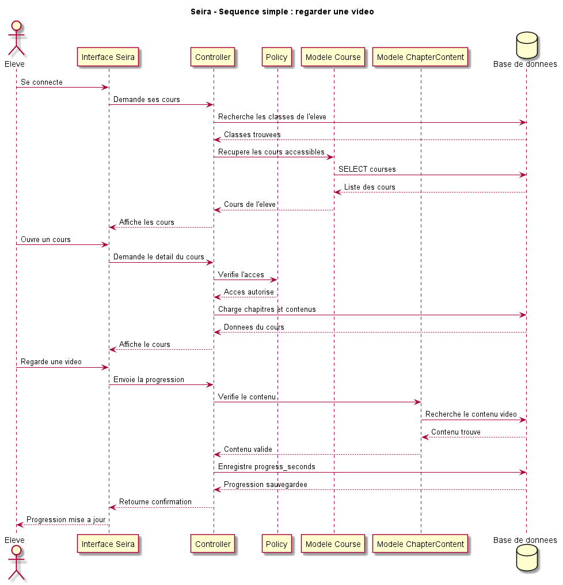
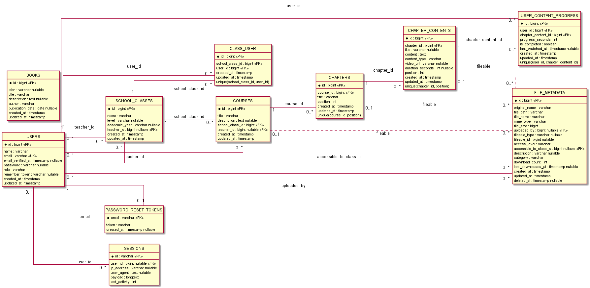
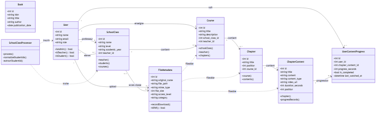

<!-- _class: cover -->

# Monto

Plateforme e-learning scolaire pour organiser les classes, publier des cours et suivre la progression des eleves.

<span class="tag">Laravel / API Platform / Blade / DevOps</span>

---

# Sommaire

<div class="grid-2">
<div class="card compact">

1. Presentation du projet
2. Cadrage / organisation
3. Conception fonctionnelle
4. Architecture technique
5. Base de donnees

</div>
<div class="card compact">

6. Developpement
7. Securite
8. Tests
9. Deploiement
10. Bilan

</div>
</div>

---

# 1. Presentation du projet

## Le besoin

Centraliser un environnement scolaire simple et coherent :

<div class="grid">
<div class="card">
<h3>Admin</h3>
<p>Supervise les utilisateurs, les classes, les cours et les donnees.</p>
</div>
<div class="card">
<h3>Professeur</h3>
<p>Cree des cours, structure les chapitres et publie les contenus.</p>
</div>
<div class="card">
<h3>Eleve</h3>
<p>Consulte les cours de sa classe et reprend sa progression.</p>
</div>
</div>

---

# Objectifs de demonstration

| Attendu | Reponse dans Monto |
|---|---|
| Application fonctionnelle | Espaces admin, prof et eleve |
| Conception | Cas d'utilisation, sequence, classes, MPD |
| Architecture | Laravel, API Platform, policies, events |
| Qualite | Tests API, tests RBAC, parcours complet |
| DevOps | Migrations, seeders, build Vite, cache prod |

<div class="note">Fil conducteur : creer un cours, publier un contenu, l'ouvrir cote eleve, puis enregistrer la progression.</div>

---

# 2. Cadrage / organisation

## Perimetre realise

<div class="grid-2 compact">
<div class="card">

- Authentification par session
- Redirection vers l'espace du role
- Gestion classes, cours, chapitres
- Contenus texte et video
- Suivi de progression

</div>
<div class="card">

- API REST documentee
- Upload et download de fichiers
- Policies RBAC
- Events et listeners
- Tests automatises

</div>
</div>

---

# Organisation du code

```text
app/
  Models/        Entites Eloquent exposees en API
  Policies/      Regles d'autorisation
  Events/        Evenements metier
  Listeners/     Reactions aux evenements
  State/         Processors API Platform
  Http/
    Controllers/ Vues web Blade

database/
  migrations/    Structure SQL versionnee
  factories/     Donnees de test
  seeders/       Donnees de demonstration
```

---

# Methode de travail

| Etape | Livrable |
|---|---|
| Analyse | brief fonctionnel, roles, parcours |
| Conception | cas d'utilisation, classe, sequence, MPD |
| Implementation | modeles, routes, API, vues, policies |
| Verification | tests unitaires, API, parcours complet |
| Livraison | build front, migrations, documentation |

---

# Choix et limites

<div class="grid-2">
<div class="card">
<h3>Choix assumes</h3>

- Blade + Tailwind pour rester proche de Laravel
- API Platform pour exposer rapidement les ressources
- Policies Laravel pour securiser chaque ressource
- Events/listeners pour separer les effets metier

</div>
<div class="card">
<h3>Points limites</h3>

- Pas encore de vraie CI/CD
- Notifications preparees mais pas industrialisees
- Front fonctionnel, ameliorable en design system complet
- Swagger a durcir en production

</div>
</div>

---

# 3. Conception fonctionnelle

## Cas d'utilisation



<small>Source : `Cas Utilisation.pdf` / rendu depuis `diagramme-cas-utilisation-seira.puml`.</small>

---

# Parcours principal

## Scenario eleve



<small>Source : `Sequence.pdf` / rendu depuis `diagramme-sequence-seira.puml`.</small>

---

# Wireframes

<div class="grid-2">
<div>
<h3>Espace eleve</h3>

</div>
<div>
<h3>Lecture video</h3>

</div>
</div>

---

# 4. Architecture technique

## Stack

| Couche | Technologie |
|---|---|
| Backend | Laravel 12 / PHP |
| API | API Platform Laravel |
| ORM | Eloquent |
| Front | Blade, TailwindCSS, Alpine.js |
| Build | Vite |
| Tests | PHPUnit |
| Base | SQL via migrations Laravel |

---

# Architecture applicative

```text
Navigateur
   |
   v
Routes web / routes API
   |
   +--> Controllers Blade --> vues par role
   |
   +--> API Platform ------> ressources REST
             |
             v
      Policies + Models Eloquent
             |
             v
        Base de donnees
```

<div class="note">Les droits ne sont pas portes par l'interface : ils sont verifies dans Laravel.</div>

---

# Routes et API

```php
Route::middleware('auth')->group(function () {
    Route::get('/space/admin', [LearningSpaceController::class, 'admin'])
        ->middleware('role:admin');

    Route::get('/space/prof', [LearningSpaceController::class, 'prof'])
        ->middleware('role:prof');

    Route::get('/space/eleve', [LearningSpaceController::class, 'eleve'])
        ->middleware('role:eleve');
});
```

API documentee :

```text
/api/users, /api/school_classes, /api/courses, /api/chapters,
/api/chapter_contents, /api/user_content_progresses, /api/file_metadata
```

---

# Events et listeners

```text
Action utilisateur
  -> Controller / Processor / Observer
    -> Event metier
      -> Listener
        -> logs, statistiques, notifications futures
```

| Event | Role |
|---|---|
| `UserEnrolledInClass` | tracer une inscription |
| `ContentProgressUpdated` | suivre la progression |
| `CourseCreated` | reagir a une creation de cours |
| `CourseCompleted` | preparer stats et notifications |

---

# 5. Base de donnees

## MPD



<small>Source : `MPD.pdf` / rendu depuis `mpd-sirae.puml`.</small>

---

# Schema de classes



<small>Source complete : `diagramme-classes-sirae.mmd`.</small>

---

# Contraintes importantes

| Table | Point cle |
|---|---|
| `class_user` | relation many-to-many eleves/classes |
| `courses` | rattache un cours a une classe et un professeur |
| `chapters` | ordre par `position` dans un cours |
| `chapter_contents` | contenu texte ou video |
| `user_content_progress` | unique par utilisateur + contenu |
| `file_metadata` | fichier polymorphe + niveau d'acces |

---

# 6. Developpement

## Modeles principaux

<div class="grid">
<div class="card">
<p class="metric">3</p>
<p>roles : admin, prof, eleve</p>
</div>
<div class="card">
<p class="metric">5</p>
<p>niveaux pedagogiques : classe, cours, chapitre, contenu, progression</p>
</div>
<div class="card">
<p class="metric">REST</p>
<p>ressources exposees via API Platform</p>
</div>
</div>

---

# Exemple de code : modeles

```php
class Course extends Model
{
    protected $fillable = [
        'title',
        'description',
        'school_class_id',
        'teacher_id',
    ];

    public function schoolClass(): BelongsTo
    {
        return $this->belongsTo(SchoolClass::class);
    }

    public function chapters(): HasMany
    {
        return $this->hasMany(Chapter::class);
    }
}
```

---

# API : validation et synchronisation

```php
new Post(rules: [
    'title' => 'required|string|max:255',
    'school_class_id' => 'required_without:schoolClass|integer',
    'schoolClass' => ['required_without:school_class_id',
        'regex:/^(\/api\/school_classes\/\d+|\d+)$/'],
])
```

```php
$persisted->students()->sync($newStudentIds);
```

<div class="note">Le processor synchronise les eleves dans la table pivot au lieu de stocker une liste dans une colonne.</div>

---

# Fichiers et interface prof

<div class="grid-2">
<div class="compact">

- upload PDF, video, image, docx
- taille maximale : 100 MB
- acces : `private`, `class`, `public`
- compteur de telechargements
- association a un cours, chapitre ou contenu

</div>
<div>

</div>
</div>

---

# Wireframes cote professeur

<div class="grid-2">
<div>
<h3>Tableau de bord</h3>

</div>
<div>
<h3>Vue matiere</h3>

</div>
</div>

---

# 7. Securite

## RBAC

```php
public const ROLE_ADMIN = 'admin';
public const ROLE_TEACHER = 'prof';
public const ROLE_STUDENT = 'eleve';

public function hasRole(string $role): bool
{
    return self::normalizeRole($this->role)
        === self::normalizeRole($role);
}
```

| Role | Acces |
|---|---|
| Admin | supervision globale |
| Prof | ses classes, ses cours, ses contenus |
| Eleve | ses cours et sa progression |

---

# Policies

```php
public function create(User $user): bool
{
    return $user->isAdmin() || $user->isTeacher();
}
```

<div class="grid-2 compact">
<div class="card">
<h3>Ce que ca protege</h3>

- creation de cours
- modification de classes
- consultation de progression
- acces aux fichiers

</div>
<div class="card">
<h3>Ce que les tests verifient</h3>

- 403 pour les actions interdites
- filtrage selon la classe
- professeur limite a ses ressources
- admin avec bypass global

</div>
</div>

---

# Securite fichiers et production

| Sujet | Mesure |
|---|---|
| Fichiers prives | proprietaire ou admin |
| Fichiers de classe | inscription dans la classe |
| Fichiers publics | acces autorise |
| API | policies sur les ressources |
| Production | `API_REQUIRE_AUTH=true` possible |
| Swagger | desactivation possible hors besoin |

---

# 8. Tests

## Strategie

| Type | Objectif |
|---|---|
| Unitaires | relations Eloquent et logique metier |
| Feature | routes, vues, uploads |
| API | validation, CRUD, formats ID/IRI |
| Securite | RBAC et 403 |
| Integration | parcours utilisateur complet |

Commandes :

```bash
php artisan test
php artisan test tests/Feature/CompleteUserJourneyTest.php
```

---

# Parcours complet teste

```text
Admin cree professeur et classe
Professeur cree cours, chapitres et contenus
Admin inscrit Marie Dubois en 6A
Eleve consulte le cours
Eleve regarde 600s / 1200s
Progression mise a jour
Evenement ContentProgressUpdated emis
Prof et admin consultent les progressions
Autres eleves recoivent 403
```

<div class="note">Ce test prouve que les modules fonctionnent ensemble, pas seulement un par un.</div>

---

# 9. Deploiement

## Lancement local

```bash
composer install
npm install
cp .env.example .env
php artisan key:generate
php artisan migrate --seed
php artisan serve
npm run dev
```

Points a configurer :

- base de donnees
- stockage fichiers
- URL applicative
- mode API et Swagger

---

# Mise en production

```bash
composer install --no-dev --optimize-autoloader
npm run build
php artisan migrate --force
php artisan config:cache
php artisan route:cache
php artisan view:cache
```

<div class="note">Le build Vite est essentiel : sans lui, Tailwind et les composants front peuvent apparaitre casses.</div>

---

# Points DevOps retenus

<div class="grid-2 compact">
<div class="card">
<h3>Fiabilite</h3>

- migrations versionnees
- seeders de demonstration
- tests automatises
- logs via events/listeners

</div>
<div class="card">
<h3>Livraison</h3>

- configuration separee dans `.env`
- build front reproductible
- caches Laravel
- documentation API

</div>
</div>

---

# 10. Bilan

<div class="grid">
<div class="card">
<h3>Fonctionnel</h3>
<p>Parcours clair pour admin, prof et eleve.</p>
</div>
<div class="card">
<h3>Technique</h3>
<p>Laravel structure, API REST, ORM, policies et events.</p>
</div>
<div class="card">
<h3>Qualite</h3>
<p>Tests coherents, documentation et logique de deploiement.</p>
</div>
</div>

Ameliorations possibles : statistiques avancees, notifications email, export des progressions, pipeline CI/CD, design system complet.

## Questions

Merci pour votre attention.
